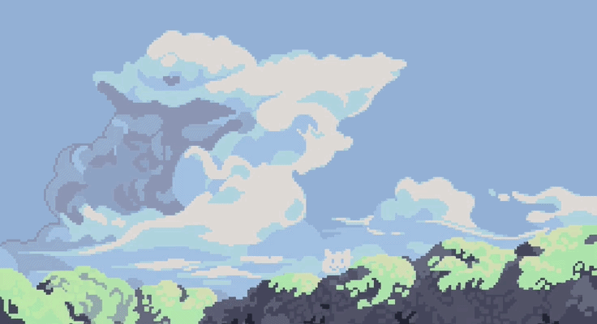
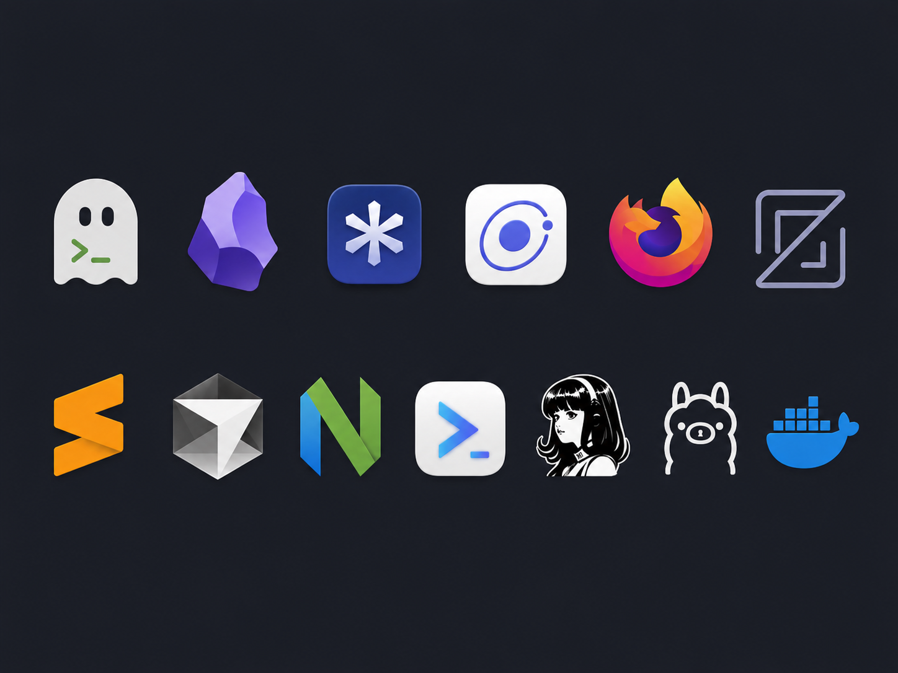
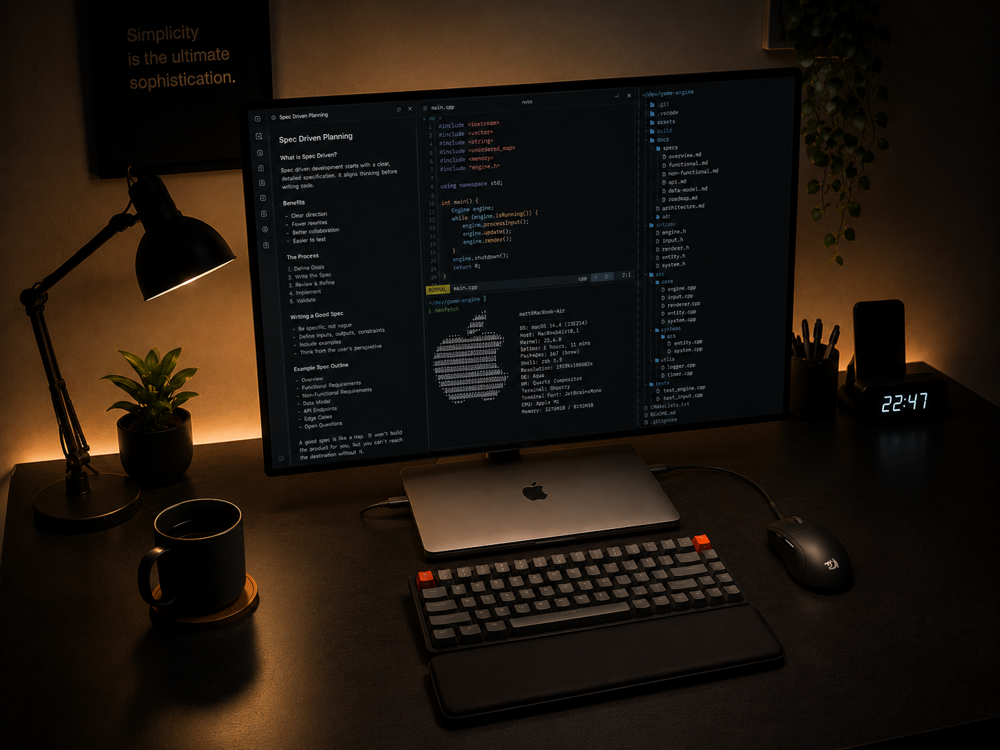

<h1>Matthew Staniswinata</h1>

<h2>Tech stack</h2>

<picture>
  <source media="(prefers-color-scheme: light)" srcset="https://www.gitskins.com/api/section/stack?username=ms-092&theme=neon&avatar=https%3A%2F%2Favatars.githubusercontent.com%2Fu%2F56186156%3Fu%3D8efddb117aa858aadafe6d0a210a22e48fa0823e%26v%3D4&style=terminal&v=oss-stack-1&mode=light" />
  
</picture>

<h2>Projects overview</h2>

<picture>
  <source media="(prefers-color-scheme: light)" srcset="https://www.gitskins.com/api/section/projects?username=ms-092&theme=github-dark&avatar=https%3A%2F%2Favatars.githubusercontent.com%2Fu%2F56186156%3Fu%3D8efddb117aa858aadafe6d0a210a22e48fa0823e%26v%3D4&repos=ms-092%2FDS_RM_FP%2Cms-092%2FAlgo_FProject%2Cms-092%2FBiology_FP%2Cms-092%2FMineZork&v=recruiter-projects-1&mode=light" />
  
</picture>

Matthew-23025391... · recruiter-ready profile generated with <a href="https://www.gitskins.com/readme-generator">GitSkins</a>

